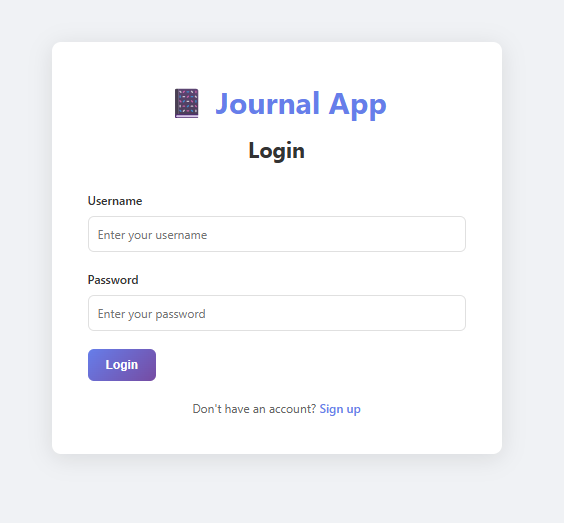
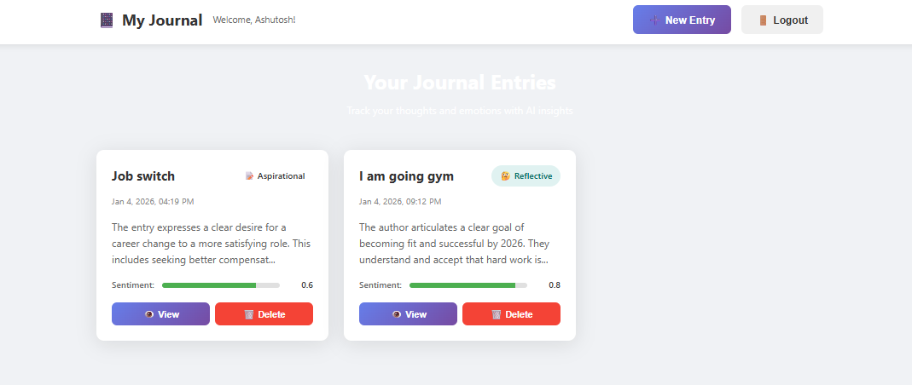
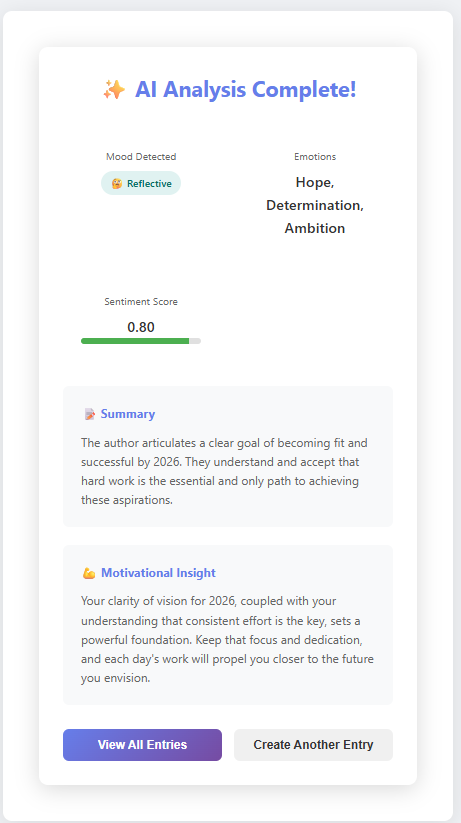
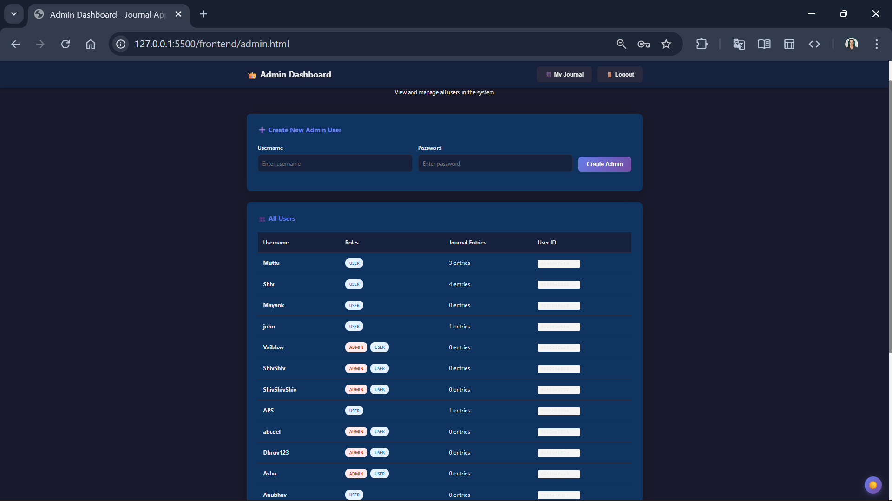

📔 AI-Powered Journal Application

A secure journaling application built with Spring Boot and Google Gemini AI.
The system analyzes journal entries to detect mood, emotions, and sentiment, and provides AI-generated summaries and motivational insights.

✨ Features
Core Features

Secure user authentication (Spring Security – Basic Auth)

Role-based access control (USER / ADMIN)

Create, read, update, and delete journal entries

User-specific data isolation

AI Features

Automatic mood detection

Emotion extraction from journal text

Sentiment score generation

AI-generated summaries

Personalized motivational feedback

Re-analysis of existing entries

Admin Features

View all registered users

Create admin accounts

System-level user management

🏗️ Project Structure
Journal/
├── backend/    # Spring Boot REST APIs
└── frontend/   # HTML, CSS, JavaScript UI

🛠️ Tech Stack

Backend

Java 17

Spring Boot

Spring Security

Database

MongoDB Atlas

AI

Google Gemini API

Frontend

HTML

CSS

JavaScript

⚙️ Run Locally (Backend)
mvn clean install
mvn spring-boot:run

Application runs at:

http://localhost:8080

🌐 Frontend Pages
---

## 📸 Screenshots

The following screenshots demonstrate the working of the application and system output.

---

### 🔐 Login Page

---

### 📊 User Dashboard

---

### ✍️ Create Journal Entry & AI Analysis

---

### 🛠️ Admin Dashboard

---

ℹ️ Frontend communicates with backend via REST APIs using JavaScript fetch.

🔌 API Highlights
Method	Endpoint	Description
POST	/public/create-user	Register new user
GET	/journal	Get user journal entries
POST	/journal	Create entry with AI analysis
PUT	/journal/id/{id}	Update journal entry
DELETE	/journal/id/{id}	Delete journal entry
POST	/journal/reanalyze/{id}	Re-run AI analysis
GET	/admin/all-user	View all users (ADMIN)
📸 Screenshots
🔐 Login Page

📊 Dashboard

✍️ Create Journal Entry

🛠️ Admin Dashboard

🔐 Security

BCrypt password encryption

HTTP Basic Authentication

Role-based authorization

Users can access only their own journal entries

🚀 Future Enhancements

React-based frontend

Mood analytics dashboard

Journal export (PDF)

Image attachments

Search & filtering

Dark mode

👤 Author

Vaibhav Singh
GitHub: https://github.com/Vaibhavsingh-23

LinkedIn: https://www.linkedin.com/in/vaibhavsinghnmp

⭐ Acknowledgments

Google Gemini AI

Spring Boot

MongoDB
