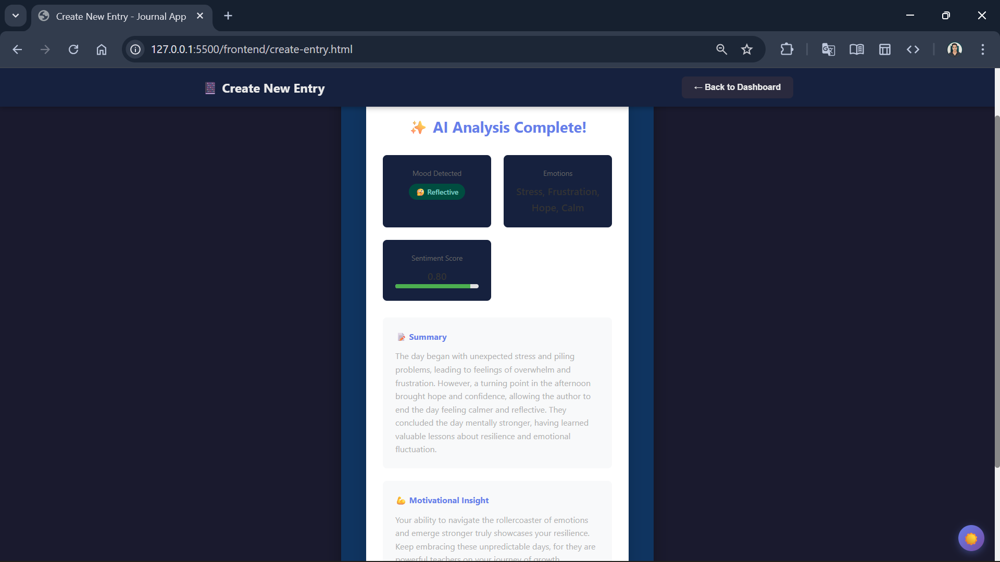
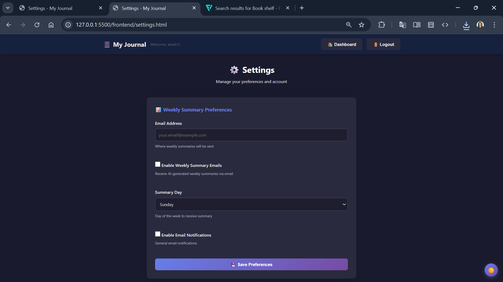

# 📔 AI-Powered Journal Application

A full-stack journaling application with **Google Gemini AI** integration for intelligent mood detection, emotion analysis, and personalized insights.

---

## ✨ Features

- 🔐 **Secure Authentication** - User registration and login with BCrypt encryption
- 📝 **Journal Entries** - Create and view personal journal entries
- 🤖 **AI Analysis** - Automatic mood detection, emotion extraction, and sentiment scoring
- 📊 **Progress Tracking** - Writing streaks, weekly stats, and entry counts
- 📧 **Weekly Summaries** - AI-generated weekly summaries with email delivery
- ⚙️ **User Settings** - Email preferences for weekly summaries
- 👑 **Admin Dashboard** - User management and system overview
- 🌙 **Dark Mode** - Beautiful dark theme support

---

## 📸 Screenshots

### Login Page


Clean and secure authentication interface with signup option.

---

### Dashboard


Main dashboard displaying journal entries with mood indicators, sentiment scores, and progress tracking widgets showing current streak, longest streak, weekly count, and total entries.

---

### AI Analysis


Every entry is automatically analyzed by Google Gemini AI for:
- 🎭 Mood Detection
- 💭 Emotion Extraction
- 📈 Sentiment Scoring
- 📝 AI-Generated Summary
- 💪 Motivational Insights

---

### Weekly Summary


AI-generated weekly summaries that analyze your week's entries and provide insights into your emotional patterns and thoughts.

---

### Settings


Manage your preferences:
- Email configuration for weekly summaries
- Choose which day to receive summaries
- Enable/disable email notifications

---

### Admin Dashboard


Admin capabilities:
- View all registered users
- Create new admin users
- Monitor user activity and entry counts
- User role management

---

## 🛠️ Tech Stack

**Backend:** Java 17, Spring Boot 3.4.5, Spring Security, MongoDB Atlas  
**AI:** Google Gemini API  
**Frontend:** HTML5, CSS3, Vanilla JavaScript

---

## 🚀 Quick Start

### Prerequisites
- Java 17+
- Maven 3.6+
- MongoDB Atlas account
- Google Gemini API key

### Installation

1. **Clone the repository**
```bash
git clone https://github.com/Vaibhavsingh-23/Journal.git
cd Journal
```

2. **Configure backend**

Edit `backend/src/main/resources/application.properties`:
```properties
spring.data.mongodb.uri=mongodb+srv://<username>:<password>@cluster.mongodb.net/journal_db
gemini.api.key=YOUR_GEMINI_API_KEY
server.port=8080
```

3. **Start backend**
```bash
cd backend
mvn spring-boot:run
```

4. **Start frontend**
```bash
cd frontend
# Open index.html with Live Server or any HTTP server
```

5. **Access the application** at `http://localhost:5500`

---

## 📡 API Endpoints

### Public
- `POST /public/create-user` - Register new user

### Journal
- `GET /journal` - Get all entries
- `POST /journal` - Create entry with AI analysis
- `GET /journal/id/{id}` - Get specific entry
- `POST /journal/reanalyze/{id}` - Re-run AI analysis

### Dashboard
- `GET /dashboard/progress` - Get progress stats
- `GET /dashboard/weekly-summary` - Get weekly summary
- `POST /dashboard/generate-summary` - Generate new summary

### User
- `PUT /user/preferences` - Update email preferences

### Admin
- `GET /admin/all-user` - Get all users
- `POST /admin/create-admin-user` - Create admin

---

## 📁 Project Structure

```
Journal/
├── backend/              # Spring Boot REST API
│   ├── src/main/java/
│   │   ├── controller/   # REST controllers
│   │   ├── service/      # Business logic
│   │   ├── repository/   # MongoDB repositories
│   │   └── entity/       # Data models
│   └── pom.xml
├── frontend/             # Vanilla JavaScript frontend
│   ├── index.html        # Login page
│   ├── dashboard.html    # Main dashboard
│   ├── create-entry.html # Create entry page
│   ├── settings.html     # User settings
│   ├── admin.html        # Admin panel
│   └── css/style.css     # Styles
└── screenshots/          # UI screenshots
```

---

## 🔒 Security

- **BCrypt Password Encryption** - All passwords are securely hashed
- **HTTP Basic Authentication** - Secure credential transmission
- **Role-Based Access Control** - USER and ADMIN roles
- **Data Isolation** - Users can only access their own entries
- **Input Validation** - Server-side validation on all inputs

---

## 👨‍💻 Author

**Vaibhav Singh**  
GitHub: [@Vaibhavsingh-23](https://github.com/Vaibhavsingh-23)  
LinkedIn: [vaibhavsinghnmp](https://www.linkedin.com/in/vaibhavsinghnmp)

---

## 🙏 Acknowledgments

Built with Spring Boot, MongoDB, and Google Gemini AI

---

<div align="center">

**Made with ❤️ and ☕**

⭐ Star this repo if you found it helpful!

</div>
